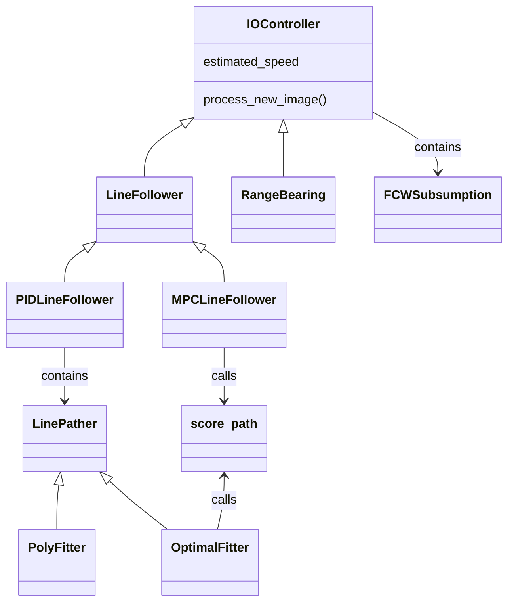

```mermaid
classDiagram
IOController <|-- LineFollower
IOController : process_new_image()
IOController : estimated_speed
IOController <|-- RangeBearing
IOController --> FCWSubsumption : contains
LineFollower <|-- PIDLineFollower
LineFollower <|-- MPCLineFollower
PIDLineFollower --> LinePather : contains
LinePather <|-- PolyFitter
LinePather <|-- OptimalFitter
score_path <-- OptimalFitter : calls
MPCLineFollower --> score_path : calls
```

