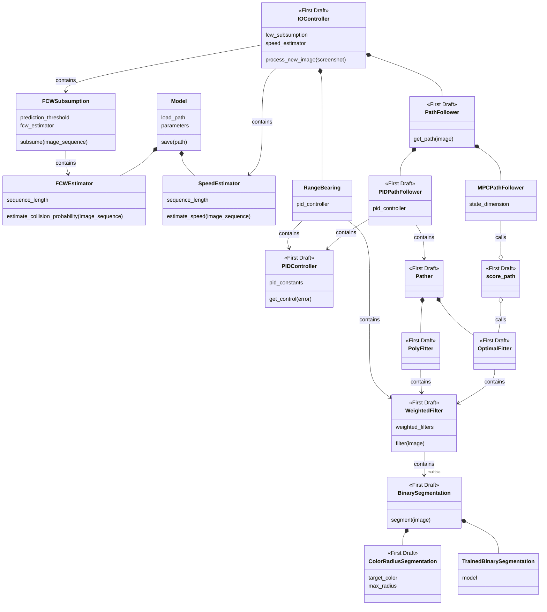

- [ ] Add critical attributes/methods to the outPath above.
- [ ] Rethink the critical optimal pathing and optimal control parts of the design.
- [ ] Devise a way to define configurations and propagate parameters through the whole program, perhaps with a shared dictionary or named tuple.
- [ ] Do initial breaking changes on the library end, starting with the classes marked `<<First Draft>>`.
- [ ] Do initial breaking changes on the user end.
- [ ] Work from both ends until refactor is done.

`weighted_filters` will be something like

```python
weighted_filters = {
    'and': [
        (1.0, ColorRadiusSegmentation(waypoint_color, default_color_radius)),
        (0.1, ColorRadiusSegmentation(waypoint_color, default_color_radius)),
    ]
}
```

The idea is that this sets us up for making a costmap for optimal pathing. But maybe it's simultaneously too complex (will I ever need an 'or'?) and not complex enough (how can I handle selectively smoothing filters?).
