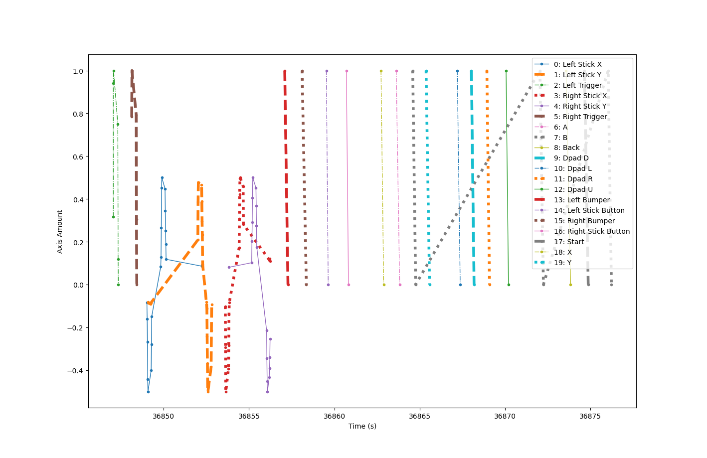

- [x] Do this input sequence:

| action             | index where movement seen |
| ------------------ | ------------------------- |
| Left Trigger       | 2                         |
| Right Trigger      | 5                         |
| Left Stick X       | 0                         |
| Left Stick Y       | 1                         |
| Right Stick X      | 3                         |
| Right Stick Y      | 4                         |
| Left Bumper        | 13                        |
| Right Bumper       | 15                        |
| Left Stick Button  | 14                        |
| Right Stick Button | 16                        |
| X                  | 18                        |
| A                  | 6                         |
| B                  | 7                         |
| Y                  | 19                        |
| Dpad L             | 10                        |
| Dpad D             | 9                         |
| Dpad R             | 11                        |
| Dpad U             | 12                        |
| B                  | 7                         |
| Back               | 8                         |
| Start              | 17                        |
| B                  | 7                         |

*Resulting data:*

